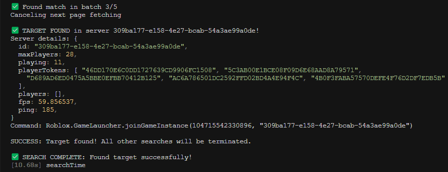

# 🎮 Roblox Server Sniper

[](https://github.com/yourname/roblox-snipe)
[](LICENSE)
[](https://nodejs.org/)

<div align="center">
  
</div>

## 📋 Overview

**Roblox Server Sniper** is a high-performance tool designed to find specific Roblox players by searching through game servers efficiently. The tool uses sophisticated parallel processing and proxy rotation to quickly identify which server your target player is in.

## ✨ Features

- 🔍 **Ultra-Fast Searching**: Uses optimized algorithms and parallel processing to search multiple servers simultaneously
- 🔄 **Proxy Support**: Rotates through proxies to prevent rate limiting
- ⚡ **Intelligent Cancellation**: Stops all processes once a target is found to save resources
- 🎯 **Server Prioritization**: Prioritizes servers with more players and better ping for efficient searching
- 🛡️ **Error Handling**: Robust error handling with smart retry mechanisms
- 📊 **Detailed Logs**: Provides clear logging of the search process

## 🚀 Installation

```bash
# Clone the repository
git clone https://github.com/yourname/roblox-snipe.git

# Navigate to the project directory
cd roblox-snipe

# Install dependencies
npm install
```

## 💻 Usage

```bash
# Basic usage
node main.js <username> <placeId>

# Example: Find user 'Roblox' in BlockSpin (ID: 104715542330896)
node main.js Roblox 104715542330896

# Example: Find user 'T1eTung' in JOODPAKJAI (ID: 4954512662)
node main.js T1eTung 4954512662

# Example: Find user 'DavidBaszucki' in Brookhaven (ID: 4924922222)
node main.js DavidBaszucki 4924922222
```

### Command Line Arguments

- `username`: The username of the player you want to find
- `placeId`: The Roblox place ID of the game

### How to Get Place ID

1. Go to the Roblox game page
2. Look at the URL: `https://www.roblox.com/games/4924922222/Brookhaven`
3. The number after `/games/` is the Place ID (in this example, `4924922222` for Brookhaven)

## 🔑 Proxy Configuration

### Setting Up Proxies

Create a `proxy.txt` file in the root directory with one proxy per line in the format:

```
host:port:username:password
```

Example:

```
123.45.67.89:8080:username123:p4ssw0rd123
```

### Obtaining Proxies

You can obtain reliable proxies from various proxy service providers. One recommended provider is [Webshare](https://www.webshare.io/).

#### Using Webshare Proxies:

1. Sign up for an account at [Webshare](https://www.webshare.io/)
2. Purchase a proxy plan that suits your needs (they offer datacenter, static residential, and residential proxies)
3. Download your proxy list from the dashboard
4. Format each proxy line as `host:port:username:password`
5. Save to `proxy.txt`

Webshare offers 10 free proxies with their free plan, which is excellent for testing. For production use, consider their paid plans for better reliability and performance.

Example of proper proxy formatting from Webshare:

```
123.45.67.89:8080:username123:p4ssw0rd123
98.76.54.32:5678:user456:p4ss789
```

## 🛠️ How It Works

1. **Username to User ID**: Converts the provided username to a Roblox user ID
2. **Profile Picture Retrieval**: Gets the target user's profile picture
3. **Server Scanning**: Scans game servers in parallel batches
4. **Profile Matching**: For each server, checks if any player's profile matches the target
5. **Result**: When found, provides the server ID and a command to join the server

### 🔒 Roblox Limitations & Workarounds

Roblox intentionally restricts direct access to complete player lists in servers for privacy and security reasons. Instead of providing user IDs or usernames, Roblox's API returns anonymized "player tokens" for users in each server. This tool works by:

1. Using these player tokens to request profile pictures
2. Comparing the returned profile pictures against the target player's picture
3. Finding a match to identify which server contains the target player

This approach circumvents some of Roblox's protective measures, but Roblox may occasionally update their systems to further restrict this kind of access. This is one of the primary reasons why the tool cannot guarantee 100% success rate, as the underlying APIs and security measures may change over time.

## 📝 Example Output

```
Starting search for OppBunG in place 104715542330896
Target: OppBunG | ID: 505306092 | Profile: https://t7.rbxcdn.com/image

✅ MATCH FOUND! Token: A3B5C7D9E1..., Server: 12345a67-89bc-def0-1234-56789abcdef0

✅ TARGET FOUND in server 12345a67-89bc-def0-1234-56789abcdef0!
Server details: {
  id: "12345a67-89bc-def0-1234-56789abcdef0",
  maxPlayers: 50,
  playing: 43,
  playerTokens: [...]
}
Command: Roblox.GameLauncher.joinGameInstance(104715542330896, "12345a67-89bc-def0-1234-56789abcdef0")

SUCCESS: Target found! All other searches will be terminated.
```

### Joining the Server

Once you've found the server, you can join it by:

1. Open Roblox in your browser
2. Open the browser's Developer Console (F12 or Ctrl+Shift+I)
3. Paste the provided command: `Roblox.GameLauncher.joinGameInstance(104715542330896, "12345a67-89bc-def0-1234-56789abcdef0")`
4. Press Enter to execute the command

## ⚙️ Advanced Configuration

You can modify these constants in the code to adjust performance:

- `BATCH_SIZE`: Maximum batch size for API requests (default: 100)
- `MAX_CONCURRENT_BATCHES`: Number of concurrent batch requests (default: 8)
- `BASE_DELAY`: Delay between requests (default: 200ms)
- `MAX_RETRIES`: Maximum retry attempts (default: 5)

## 🤝 Contributing

Contributions are welcome! Please feel free to submit a Pull Request.

## 📄 License

This project is licensed under the MIT License - see the [LICENSE](LICENSE) file for details.

## ⚠️ Disclaimer

This tool is for educational purposes only. Use it responsibly and in accordance with Roblox's Terms of Service.

**Important Note:** This tool does not guarantee 100% success in finding players. Even if a player is actively playing in the game, they might not be found due to various factors such as:

- Server limitations and API restrictions
- Player privacy settings
- Network issues or rate limiting
- The player being in a private or VIP server
- Temporary glitches in Roblox's server infrastructure

Please understand that while the tool uses advanced techniques to maximize success rate, some searches might not yield results despite the target being online.

---

<div align="center">
  <p>Made with ❤️ by <a href="https://github.com/jumpogpo">Thanapat Koedpiam</a></p>
</div>
